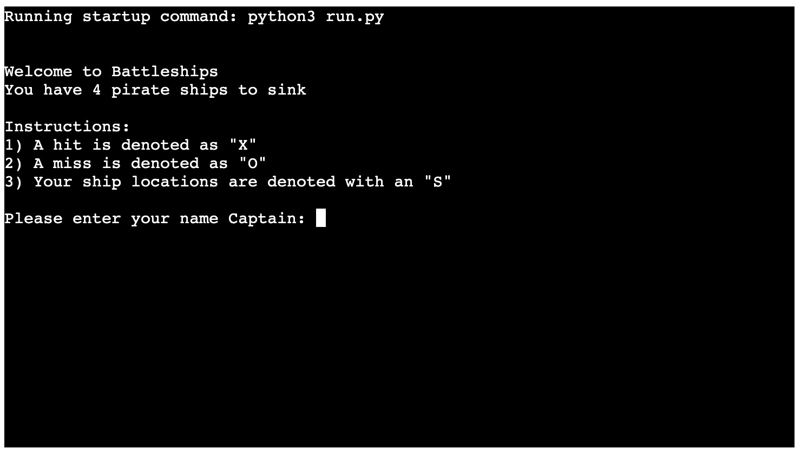
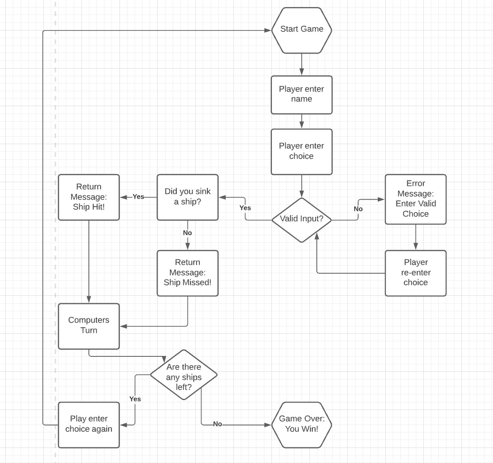

# Battleships

Welcome to my Battleships game.

Battleships is a strategy type guessing game whereby two players attempt to destroy the opposing players fleet of ships. They do this by alternating guesses of the coordinates of the concealed ships set out on a grid. 

This project uses the programming language of Python.

A live website can be found [here](https://battleships-saramorrin.herokuapp.com/)

# Site Design Considerations

### User Expectations
- The game should be engaging for the player and clearly display a winner and a loser after each turn.

## Colour Scheme and Font

To provide an improved user experience and a point of difference I decided to implement a colour scheme to the game.
I hoped that this would provide a slightly more interesting visual experience for the player and also give a better definition to the functions when there are run.

 - Player input requests and messages in Purple colour (\033[1;35;10m)
 - Win messages in Cyan colour (\033[1;36;10m)
 - Lose messages in Red colour(\033[1;31;10m)

## Site Skeleton

[Lucidchart](https://www.lucidchart.com/pages/landing?utm_source=google&utm_medium=cpc&utm_campaign=_chart_en_tier1_mixed_search_brand_exact_&km_CPC_CampaignId=1490375427&km_CPC_AdGroupID=55688909257&km_CPC_Keyword=lucid%20charts&km_CPC_MatchType=e&km_CPC_ExtensionID=&km_CPC_Network=g&km_CPC_AdPosition=&km_CPC_Creative=354596043016&km_CPC_TargetID=aud-381457345638:kwd-64262996435&km_CPC_Country=9046037&km_CPC_Device=c&km_CPC_placement=&km_CPC_target=&mkwid=stwZuDiXw_pcrid_354596043016_pkw_lucid%20charts_pmt_e_pdv_c_slid__pgrid_55688909257_ptaid_aud-381457345638:kwd-64262996435_&gclid=CjwKCAiAvriMBhAuEiwA8Cs5lRQJUbG5hAH-eB-fciVZRNMyF54zxhvCSdxGAviSsT3Nd-KnrvdxARoCln4QAvD_BwE) was used to help create a flow chart diagram for the game. It was useful as it enabled me to clearly play out all the logic and possible sernarios to plan for the game 

# Features

### Game Page

### How To Play Button

### Contact Button

# Manual Testing

# Validator Testing

# Development Cycle

# Bugs

# Deployment

To deploy my final project to the cloud I used Heroku. To do this I had to:

1. Push the latest code to GitHub.
2. Go to Heroku.
3. Select new in the top right corner.
4. Create new app.
5. Enter the app name and select Europe as the region.
6. Connect to GitHub.
7. Search for repo-name.
8. Select connect to the relevant repo you want to deploy.
9. Select the settings tab.
10. Go to Config Vars and add PORT 8000.
11. Add buildpack.
12. Select Python, then save changes.
13. Select Nodejs, then save changes.
14. Make sure that they are in this order, Heroku/Python is at top followed by Heroku/Nodejs.
15. Navigate to the deploy tab.
16. Scroll down to Automatic Deploys and select. 
17. Go to Manual Deploy and select deploy branch.

The live link can be found here - (https://battleships-saramorrin.herokuapp.com/)

# Credits

 
 
  

