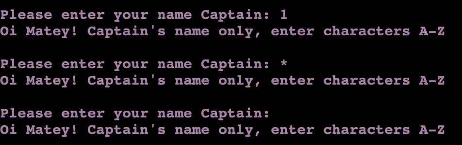

# Battleships

Welcome to my Battleships game.

Battleships is a strategy type guessing game whereby two players attempt to destroy the opposing players fleet of ships. They do this by alternating guesses of the coordinates of the concealed ships set out on a grid. 

The object of this project was to build a game which could be inactive, where the player is able to play against the computer, obtain feedback on progress throughout the game and understand who has won and lost the game at the end.

This project uses the programming language of Python.

A live website can be found [here](https://battleships-saramorrin.herokuapp.com/)

# Site Design Considerations

### User Expectations
- The game should be engaging for the player, providing fun and joy.
- It should define a clear goal for the player.
- It should clearly display a winner and a loser after each turn.
- It should be challenging and give incentive to the player to want to return to play again.

## Colour Scheme and Font

To provide an improved user experience and a point of difference I decided to implement a colour scheme to the game.
I hoped that this would provide a slightly more interesting visual experience for the player and also give a better definition to the functions when there are run.

 - Player input requests and messages in Purple colour (\033[1;35;10m)
 - Win messages in Cyan colour (\033[1;36;10m)
 - Lose messages in Red colour(\033[1;31;10m)

## Site Skeleton

[Lucidchart](https://www.lucidchart.com/pages/landing?utm_source=google&utm_medium=cpc&utm_campaign=_chart_en_tier1_mixed_search_brand_exact_&km_CPC_CampaignId=1490375427&km_CPC_AdGroupID=55688909257&km_CPC_Keyword=lucid%20charts&km_CPC_MatchType=e&km_CPC_ExtensionID=&km_CPC_Network=g&km_CPC_AdPosition=&km_CPC_Creative=354596043016&km_CPC_TargetID=aud-381457345638:kwd-64262996435&km_CPC_Country=9046037&km_CPC_Device=c&km_CPC_placement=&km_CPC_target=&mkwid=stwZuDiXw_pcrid_354596043016_pkw_lucid%20charts_pmt_e_pdv_c_slid__pgrid_55688909257_ptaid_aud-381457345638:kwd-64262996435_&gclid=CjwKCAiAvriMBhAuEiwA8Cs5lRQJUbG5hAH-eB-fciVZRNMyF54zxhvCSdxGAviSsT3Nd-KnrvdxARoCln4QAvD_BwE) was used to help create a flow chart diagram for the game. It was useful as it enabled me to clearly play out all the logic and possible scenarios to plan for the game 

# Features

Player welcome message and game instructions

Player board

Computer Board

Player sunk ship message

Computer sunk ship message

It's a draw message

Player winner message

Play again message

# Technologies Used

During the making of this game I used the following:

* [Python3](https://en.wikipedia.org/wiki/Python_(programming_language))

    Was the language used to create the game

* [GitHub](https://github.com/)

    For storing project code written in gitpod

* [GitPod](https://www.gitpod.io/)

    For use as the code editor for the project code

* [Lucid Chart](https://www.lucidchart.com/pages/landing?utm_source=google&utm_medium=cpc&utm_campaign=_chart_en_tier1_mixed_search_brand_exact_&km_CPC_CampaignId=1490375427&km_CPC_AdGroupID=55688909257&km_CPC_Keyword=lucid%20charts&km_CPC_MatchType=e&km_CPC_ExtensionID=&km_CPC_Network=g&km_CPC_AdPosition=&km_CPC_Creative=442433236001&km_CPC_TargetID=aud-833150265254:kwd-64262996435&km_CPC_Country=9046037&km_CPC_Device=c&km_CPC_placement=&km_CPC_target=&mkwid=stwZuDiXw_pcrid_442433236001_pkw_lucid%20charts_pmt_e_pdv_c_slid__pgrid_55688909257_ptaid_aud-833150265254:kwd-64262996435_&gclid=Cj0KCQiAhMOMBhDhARIsAPVml-GVF5i9_SQNDYHlUyBuErwZNeow81cGS-C4QXOTa-0HEqhSFxWbm8EaAuclEALw_wcB)

    For creating flow chart for game planning

* [Replit](https://replit.com/~)

    To test code for errors or problems

* [PEP8 Validator](http://pep8online.com/)
    
    For checking python code best practices and validation

* [Heroku](https://id.heroku.com/login)
    
    To deploy project into live environment

# Testing

Code was first tested using the PEP8 Online validator. This threw up some errors with the length of certain lines within the code being too long as detailed below:

After this was corrected no further issues were found in the code as detailed in the screenshot below:

For player name input, fields were tested using numbers, special characters and blank inputs.

For letter inputs, fields were tested using letters outside of the range, special characters, blank and number inputs.

For number inputs, fields were tested using numbers outside of the range, special characters, blank and letter inputs.

For same guess inputs, fields were tested using a guess which had already been inputed.

For yes or no play again inputs, fields were tested using letters and numbers outside of the range, blanks and special characters inputs.

# Developement

I played the game incrementally throughout development to test the features and ensure that they responded how I expected. If a feature was not responding how I expected it to then I would go back and check the code to resolve the issue.

# Bugs

- When testing the game I noticed that the computer guess was mirroring the player input guess therefore not drawing a guess randomly. This was caused by the code checking whether the computer has hit or miss having the incorrect variables passed in for the array indices. It should have been computer row guess, rather than player row guess. This was corrected and code worked as expected.

- During coding, an issue arose with the line length on certain lines. Upon checking the PEP8 guidelines, I discovered the 80 character advisory limit. Where possible, print statement strings were split with the use of double quotation marks to denote the continuation of the line.
Backslashes were not used in string statements as this resulted in spacing errors on the displayed result. 

- Upon adding colours I noticed that the background colour was displaying as a dark grey and not black as intended. This was resolved by changing the background colour from 40m to 10m.

- When testing the game I found that the "Play Again" function was not working properly, the game would not let you exit, instead just looping back round to begin the game again. 
This was corrected by breaking the while loop by adding a new global variant and setting this to true. Code then worked as expected.

# Deployment

To deploy my final project to the cloud I used Heroku. To do this I had to:

1. Push the latest code to GitHub.
2. Go to Heroku.
3. Select new in the top right corner.
4. Create new app.
5. Enter the app name and select Europe as the region.
6. Connect to GitHub.
7. Search for repo-name.
8. Select connect to the relevant repo you want to deploy.
9. Select the settings tab.
10. Go to Config Vars and add PORT 8000.
11. Add buildpack.
12. Select Python, then save changes.
13. Select Nodejs, then save changes.
14. Make sure that they are in this order, Heroku/Python is at top followed by Heroku/Nodejs.
15. Navigate to the deploy tab.
16. Scroll down to Automatic Deploys and select. 
17. Go to Manual Deploy and select deploy branch.

The live link can be found here - (https://battleships-saramorrin.herokuapp.com/)

# Credits

- An article on [Stack Abuse](https://stackabuse.com/how-to-print-colored-text-in-python/) helped me to understand how to implement colours into my code.

- This article on [Real Python](https://realpython.com/python-pep8/) helped my understanding of how to write Python code following best practices and guidelines.

- I used [Stack Overflow](https://stackoverflow.com/) to further my knowledge of classes and functions from previous questions asked by the community. 

 
 
  

